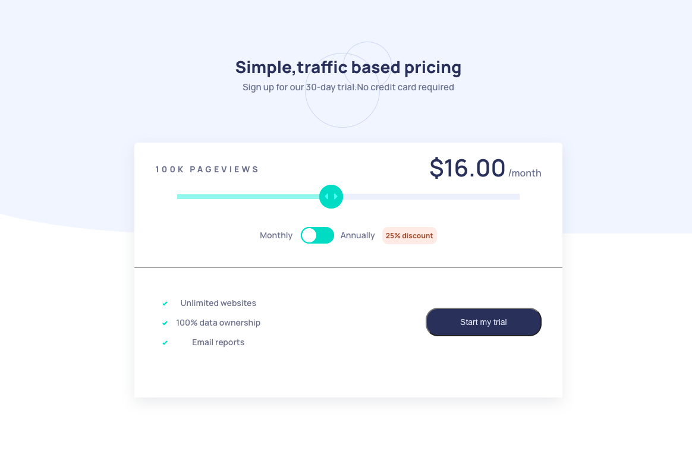

# Frontend Mentor - Interactive Pricing Component

## Overview

This is a solution to the [Interactive Pricing Component challenge on Frontend Mentor](https://www.frontendmentor.io/challenges/interactive-pricing-component-t0m8PIyY8). Frontend Mentor challenges help you improve your coding skills by building realistic projects.

## Table of contents

- [Overview](#overview)

  - [The challenge](#the-challenge)
  - [Screenshot](#screenshot)
  - [Links](#links)

  - [Tech Used/Dependencies](#tech-used)
  
 

- [Acknowledgments](#acknowledgments)

### The challenge

Users should be able to:

- View the optimal layout for the site depending on their device's screen size
- See hover states for all interactive elements on the page
- Use the slider and toggle to see prices for different page view numbers

### Screenshot

### Links

Live Site URL: (https://interactive-pricing-component-beige-three.vercel.app/)

### Tech Used/Dependencies

- React
- TypeScript
- Styled-components
- Flexbox
- Accessibility insights for Web, a chrome extension

### Acknowledgements

I borrowed inspirations from [@gracesnow](https://github.com/grace-snow) and [@AlexKMarshall](https://github.com/AlexKMarshall/interactive-pricing-component.git) on how to make the site more accessible and write clean codes.

# Getting Started with Create React App

This project was bootstrapped with [Create React App](https://github.com/facebook/create-react-app).

## Available Scripts

In the project directory, you can run:

### `npm start`

Runs the app in the development mode.\
Open [http://localhost:3000](http://localhost:3000) to view it in the browser.

The page will reload if you make edits.\
You will also see any lint errors in the console.
